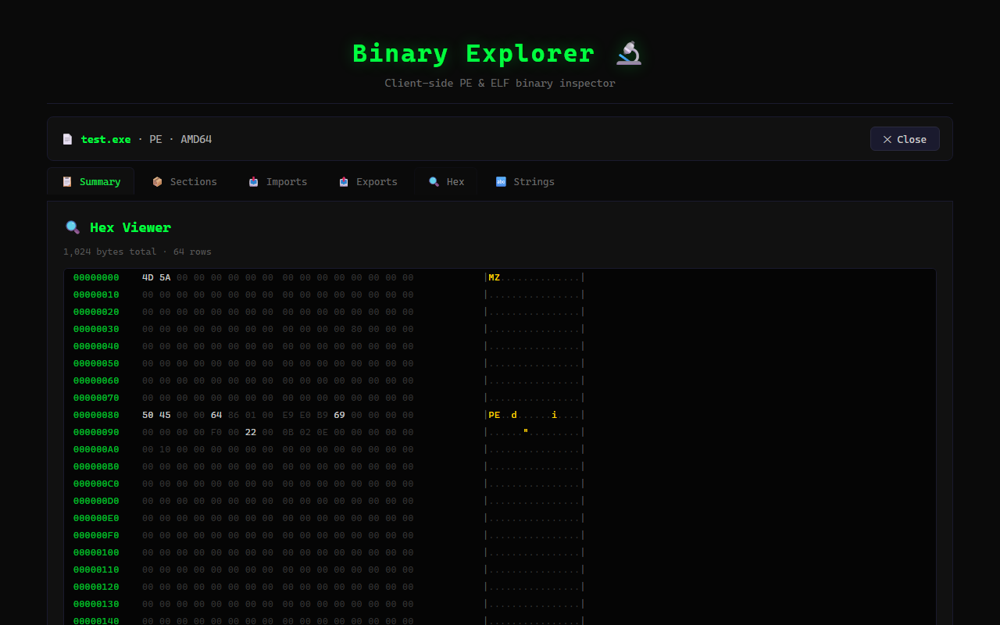

# Binary Explorer 🔬

A client-side binary file inspector for PE and ELF executables. Drop in a `.exe`, `.dll`, `.so`, or `.elf` and explore its structure — headers, sections, imports, exports, hex dumps, and embedded strings — all without uploading anything.

🌐 **[Live Demo](https://vineeththomasalex.github.io/binary-explorer/)**



## Features

- **PE & ELF Parsing** — Full support for PE32, PE32+, ELF32, and ELF64 formats
- **File Summary** — Architecture, entry point, image base, timestamps, and more at a glance
- **Section Inspector** — View section names, addresses, sizes, and permission flags
- **Import/Export Tables** — Browse DLL imports and exported symbols (PE files)
- **Hex Viewer** — Virtual-scrolled hex dump with ASCII sidebar, click-to-jump from sections
- **String Extraction** — Find embedded ASCII strings with configurable minimum length and filtering
- **100% Client-Side** — No files are uploaded anywhere; all parsing uses `DataView` / `ArrayBuffer` in the browser

## Supported Formats

| Format | Extensions |
|--------|-----------|
| PE32 (32-bit Windows) | `.exe`, `.dll`, `.sys`, `.drv` |
| PE32+ (64-bit Windows) | `.exe`, `.dll`, `.sys`, `.drv` |
| ELF32 (32-bit Linux) | `.so`, `.elf`, `.o` |
| ELF64 (64-bit Linux) | `.so`, `.elf`, `.o` |

## Tech Stack

- **React 19** + **TypeScript**
- **Vite** for dev server and builds
- Binary parsing with `DataView` / `ArrayBuffer` (zero dependencies)
- Virtual scrolling for the hex viewer
- **Playwright** for end-to-end tests

## Getting Started

```bash
npm install
npm run dev
```

Open [http://localhost:5173](http://localhost:5173) and drop a binary file onto the page.

## Build

```bash
npm run build
npm run preview
```

## Tests

```bash
# Generate the test fixture (minimal PE binary)
node tests/generate-test-binary.mjs

# Run end-to-end tests
npx playwright test
```

## Privacy

All parsing happens entirely in your browser. No files are uploaded to any server. Your binaries never leave your machine.

## License

MIT
